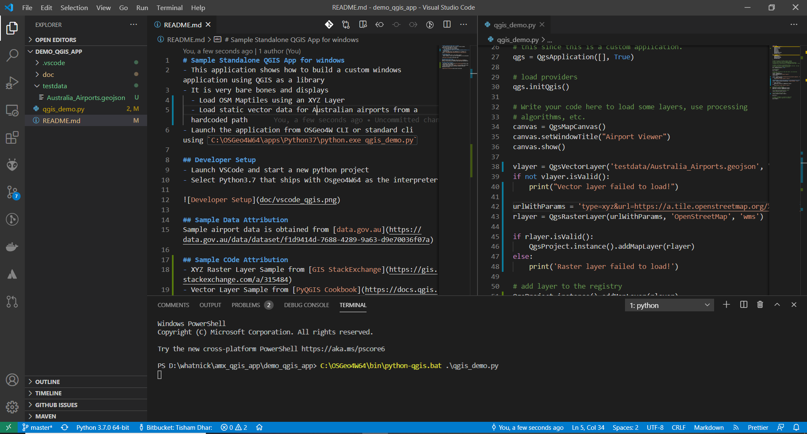
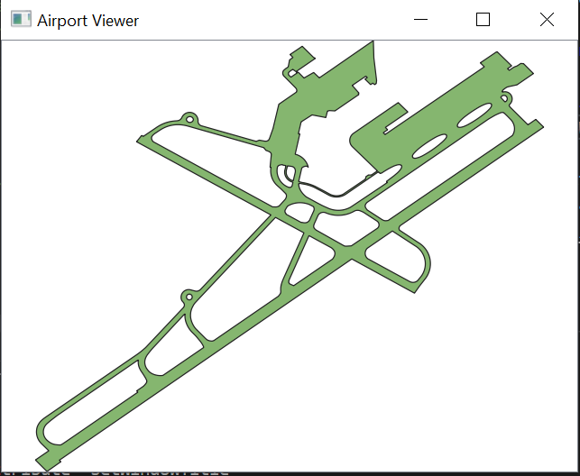

# Sample Standalone QGIS App for windows
- This application shows how to build a custom windows application using QGIS as a library
- It is very bare bones and displays
  - Load OSM Maptiles using an XYZ Layer
  - Load static vector data for Australian airports from a hardcoded path
- Launch the application from OSGeo4W CLI or standard cli using `C:\OSGeo4W64\apps\Python37\python.exe qgis_demo.py`

## Developer Setup
- Launch VSCode and start a new python project
- Select Python3.7 that ships with Osgeo4W64 as the interpreter

## Packaging executable for Windows
[PyInstaller](https://www.pyinstaller.org/) is recommended for folder / single file based distribution of the QGIS application.
There is a nice tutorial / answer on [StackOverflow](https://gis.stackexchange.com/a/178615). This approach is included here for
distribution of the application. It involves 2 steps:
- Detecting the mode in which PyInstaller is running and setting paths accordingly
- A spec file to cleanly setup options to pack the binary

To get the packaging toolind install pyinstaller via pip into the OSGeo4W python 3.7 environment ( current as of 28-09-2020). Python3-pip must be installed as a package in the osgeo4w setup. It is safer to pack a heavier directory based version of the
application to avoid possible DLL hell due to different versions of QGIS being installed on the user machine compared to the
developers.

## Sample Data Attribution
Sample airport data is obtained from [data.gov.au](https://data.gov.au/data/dataset/f1d9414d-7688-4289-9a63-d9e70036f07a)

## Sample COde Attribution
- XYZ Raster Layer Sample from [GIS StackExchange](https://gis.stackexchange.com/a/315484)
- Vector Layer Sample from [PyQGIS Cookbook](https://docs.qgis.org/testing/en/docs/pyqgis_developer_cookbook/loadlayer.html#vector-layers)

