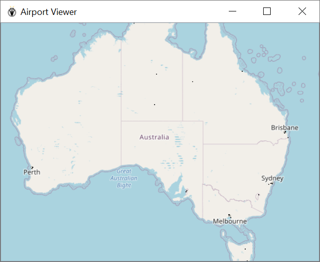

# Sample Standalone QGIS App for windows
- This application shows how to build a custom windows application using QGIS as a library
- It is very bare bones and displays
  - Load static vector data for an airport from a hardcoded path
- Launch the application from OSGeo4W CLI or standard cli using `C:\OSGeo4W64\apps\Python37\python.exe qgis_demo.py`

## Developer Setup
- Launch VSCode and start a new python project
- Select Python3.7 that ships with Osgeo4W64 as the interpreter

## Sample Data Attribution
Sample airport data is obtained from [data.gov.au](https://data.gov.au/data/dataset/f1d9414d-7688-4289-9a63-d9e70036f07a)

